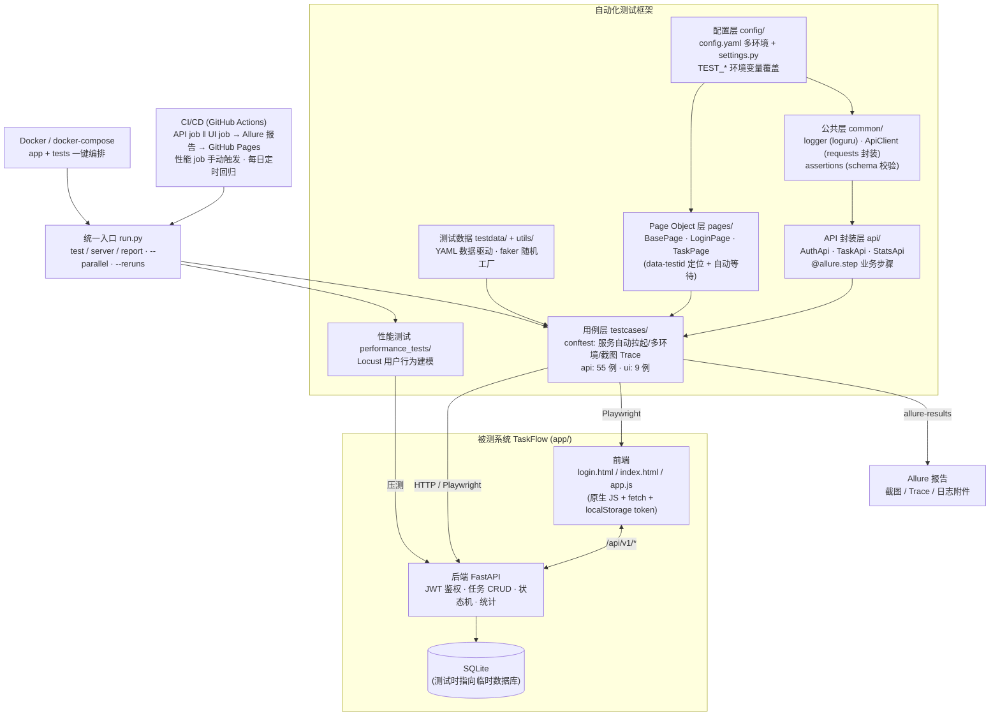
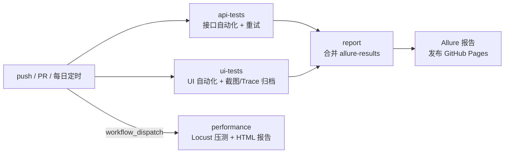

# TaskFlow 自动化测试项目

[](https://github.com/<owner>/taskflow-autotest/actions)
[](https://<owner>.github.io/taskflow-autotest/)
[](https://www.python.org/)
[](https://pytest.org)
[](https://playwright.dev)

一个**从零自建、可落地、可写进简历**的完整自动化测试项目:被测系统(TaskFlow 任务管理 Web 应用)+ 接口自动化 + Web UI 自动化 + 性能测试 + 容器化 + CI/CD 报告发布,覆盖企业级测试框架的全部核心环节。

## 项目亮点

| 能力 | 说明 |
|------|------|
| 🔬 **自建被测系统** | FastAPI + SQLite + 原生 JS 前端的任务管理系统,含 JWT 鉴权、状态机、数据权限隔离等可测性设计,不依赖任何第三方网站 |
| 🧱 **分层测试框架** | 配置层 / 公共层 / API 封装层 / Page Object 层 / 用例层 五层架构,新增用例零成本 |
| 🌍 **多环境支持** | local / test / ci 三套配置,`TEST_<KEY>` 环境变量全覆盖,一键切换本地自起服务或外部环境 |
| 🚀 **并行与重试** | pytest-xdist 并行(64 用例 10s 跑完)+ rerunfailures 失败重试,按 worker 端口偏移解决并行端口冲突 |
| 📸 **失败自诊断** | UI 用例失败自动保存全页截图 + Playwright Trace(zip 可回放),随 Allure 报告归档 |
| 🔐 **鉴权与权限** | 覆盖 JWT 过期/伪造 token、越权访问、数据权限隔离等安全测试场景 |
| 📊 **数据驱动** | YAML 测试数据 + 随机数据工厂,用例可重复执行、天然隔离 |
| ⚡ **性能压测** | Locust 模拟真实用户会话(注册→登录→操作),读写按 4:2:1 权重配比 |
| 🐳 **一键容器化** | Docker 镜像内置被测系统 + 测试框架 + 浏览器内核,`docker compose up` 全流程跑通 |
| 📈 **Allure 报告发布** | GitHub Actions 自动生成 Allure 报告并部署到 GitHub Pages,每日定时回归 |

**测试过程中通过自动化用例发现并修复了被测系统的 8 个真实缺陷**(详见 [docs/test_plan.md](docs/test_plan.md) 缺陷记录),体现了"自动化测试创造价值"的核心命题。

## 架构设计



## 技术栈

| 层 | 技术 |
|----|------|
| 被测系统 | FastAPI · SQLAlchemy 2.x · Pydantic v2 · PyJWT · 原生 HTML/JS/CSS |
| 接口自动化 | pytest · requests · allure-pytest |
| UI 自动化 | pytest-playwright · POM 模式 · data-testid 定位 · 自动等待断言 |
| 性能测试 | Locust(用户会话建模 + 权重配比) |
| 工程化 | pytest-xdist · pytest-rerunfailures · loguru · PyYAML · faker · ruff |
| 交付 | Docker · docker-compose · GitHub Actions · GitHub Pages(Allure 报告) |

## 快速开始

### 环境要求

- Python 3.12+(开发环境:3.13)
- Windows / Linux / macOS
- 可选:Docker(一键容器化运行)、allure CLI(本地查看报告)

### 1. 安装依赖

```bash
pip install -r requirements.txt
playwright install chromium      # UI 测试需要浏览器内核
```

### 2. 运行测试

```bash
python run.py test                    # 全部用例 (API + UI, 约 12s)
python run.py test --type api         # 仅接口用例
python run.py test --type web         # 仅 UI 用例
python run.py test --parallel 4       # 4 worker 并行 (约 10s)
python run.py test --reruns 1         # 失败自动重试 1 次
python run.py test --headed           # UI 有头模式 (本地调试)
python run.py test --env test         # 指向外部环境 (需先部署被测服务)
```

被测服务**无需手动启动**:local 环境下框架自动拉起 uvicorn 子进程(临时数据库),测试结束自动回收,与开发环境完全隔离。

### 3. 查看报告

```bash
allure serve reports/allure-results   # 或: python run.py report
```

失败用例自动附上**全页截图**与 **Playwright Trace**,可本地回放复现:

```bash
playwright show-trace reports/traces/<用例>.zip
```

### 4. 性能测试

```bash
python run.py server                  # 终端 1: 启动被测服务
locust -f performance_tests/locustfile.py --host http://127.0.0.1:8001
# 浏览器打开 http://localhost:8089 配置并发
# 无界面模式: locust ... --headless -u 50 -r 10 -t 2m --html reports/locust-report.html
```

### 5. Docker 一键运行

```bash
docker compose up --build    # 构建镜像并执行全部测试 (含 UI)
docker compose run tests python run.py test --type api   # 容器内仅跑接口用例
```

## 项目结构

```
taskflow-autotest/
├── app/                        # 被测系统 TaskFlow (FastAPI)
│   ├── main.py                 # 入口: lifespan 建表 / 静态文件 / health
│   ├── auth.py                 # PBKDF2 密码哈希 + JWT 签发/校验
│   ├── models.py               # User / Task ORM (含状态机枚举)
│   ├── routers/                # auth / users / tasks / stats 路由
│   ├── schemas.py              # Pydantic 请求/响应模型
│   └── static/                 # 前端: 登录页 / 任务主页 / 原生 JS
├── config/                     # 测试框架配置层
│   ├── config.yaml             # local / test / ci 多环境配置
│   └── settings.py             # 配置加载 + TEST_* 环境变量覆盖
├── common/                     # 公共层
│   ├── logger.py               # loguru 日志 (幂等初始化)
│   ├── api_client.py           # requests 封装: token / 超时 / 请求日志
│   └── assertions.py           # 状态码断言 / JSON Schema 校验
├── api/                        # API 业务封装层 (@allure.step)
│   ├── auth_api.py             # 注册 / 登录 / 当前用户
│   └── task_api.py             # 任务 CRUD / 状态流转 / 统计
├── pages/                      # Page Object 层
│   ├── base_page.py            # 页面基类: goto / 等待 / 元素定位
│   ├── login_page.py           # 登录页: 登录 / 注册 / 错误提示
│   └── task_page.py            # 任务页: 增删改查 / 筛选 / 统计看板
├── testcases/                  # 用例层
│   ├── conftest.py             # 服务自动拉起 / 多环境 / 客户端隔离 / 截图 Trace
│   ├── api/                    # 接口用例 ×55: 鉴权 / CRUD / 状态流转 / 权限隔离 / 统计
│   └── ui/                     # UI 用例 ×9: 登录注册 / 完整任务旅程 / 异常交互
├── testdata/                   # YAML 数据驱动 (用户 / 任务边界值)
├── utils/data_factory.py       # 随机数据工厂 (用户名 / 密码 / 任务)
├── performance_tests/          # Locust 性能测试脚本
├── run.py                      # 统一入口: test / server / report
├── pytest.ini                  # pytest 配置 (markers / alluredir)
├── Dockerfile                  # 镜像: 被测系统 + 框架 + 浏览器内核
├── docker-compose.yml          # app + tests 一键编排
├── .github/workflows/test.yml  # CI: API ‖ UI → Allure → Pages, 定时回归, 手动压测
└── docs/                       # 测试计划 / 用例设计 / 架构文档
```

## 测试设计

### 分层策略(测试金字塔)

| 层 | 数量 | 覆盖目标 | 运行时长 |
|----|------|---------|---------|
| 接口自动化(API) | 55 | 业务规则全量:鉴权、CRUD、状态机、权限隔离、统计、边界值、异常 | ~6s |
| Web UI(E2E) | 9 | 关键用户旅程:登录注册、完整任务生命周期、异常交互 | ~6s |
| 性能 | 4 场景 | 登录注册、列表查询、创建、生命周期(4:2:1:1 权重) | 按需 |

UI 层只验证关键旅程,数据预置走 API —— 稳定、快速、定位问题层级清晰。

### 核心用例设计(节选,全量见 docs/test_case_design.md)

- **状态机**:pending → in_progress → done 全路径 + done 终态(转出返回 409)+ 非法流转 422
- **数据权限隔离**:用户 A 无法查看/修改/删除用户 B 的任务(一律 404 隐藏存在性)
- **安全**:无 token 401 / 伪造 token 401 / 过期 token 401(本地环境自签过期 JWT)
- **边界值**:用户名 3-20 位、密码 6-64 位、标题 1-100 字符(含数据库直连落库断言)
- **重复性**:注册重名 409、任务删除两次 404、无效 ID 404

## CI/CD

GitHub Actions 流水线(`.github/workflows/test.yml`):



- **自动触发**:push / PR 到 main,每日 02:30(北京时间)定时回归
- **报告在线可访问**:Allure 报告部署到 GitHub Pages,附失败截图与 Trace
- **性能测试手动触发**:节约 CI 时长

> 原 demo 项目的 CI 存在"直接上传 report.html 但从未生成该文件"的缺陷,本项目中已重构为 Allure results → 报告生成 → Pages 发布的完整链路。

## 被测系统业务规则(测试依据)

| 规则 | 约束 |
|------|------|
| 用户名 | 3-20 位,仅 [a-zA-Z0-9_],全局唯一 |
| 密码 | 6-64 位 |
| 任务标题 | 1-100 字符,不可为空 |
| 状态机 | pending → in_progress → done;done 为终态,转出返回 409 |
| 权限 | 用户仅能访问自己的任务,他人任务一律 404(隐藏存在性) |
| 统计 | total / pending / in_progress / done / overdue / completion_rate |

## 文档

- [测试计划](docs/test_plan.md) —— 范围、策略、进度、缺陷记录
- [用例设计](docs/test_case_design.md) —— 模块划分、等价类/边界值、执行顺序
- [架构文档](docs/architecture.md) —— 分层设计、关键机制(服务拉起/并行端口/隔离)

## License

MIT(被测系统与测试框架均为自建,可直接用于简历与面试演示)
